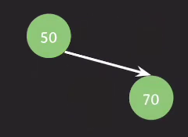
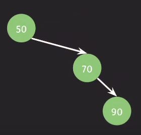
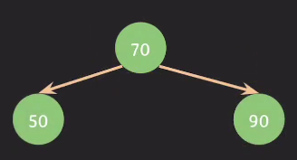
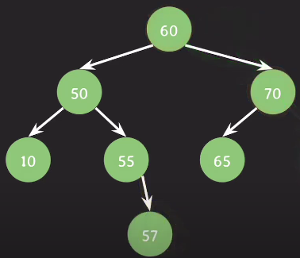
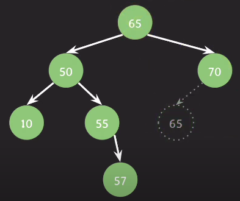
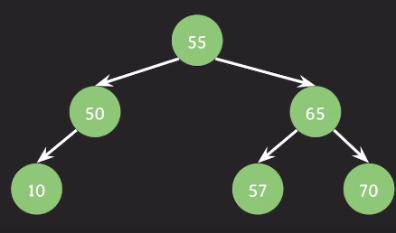
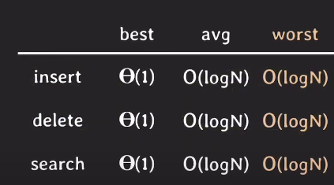

# AVL 트리

이진 탐색 트리(BST)의 한 종류

스스로 균형을 잡는 트리(balance factor를 통해 균형 유지)

## 노드의 balance factor 

임의의 노드 x에 대해서  

BF(x) = 왼쪽 자식 서브 트리의 높이 - 오른쪽 자식 서브 트리의 높이

## AVL 트리의 특징

트리의 모든 노드들은 BF(x) = {-1, 0, 1}이어야 한다.

## AVL 트리의 균형 잡기

트리의 삽입 or 삭제 후  
BF != {-1, 0, 1} 인 노드가 생기면  
균형을 맞추는 작업을 수행한다.

> 균형을 잡는 작업을 제외하면, BST와 같은 특징을 지니고 있다.

---

## AVL 트리가 균형을 잡는 예제

### 균형을 잡아야 하는 상태 1

위 상태에서 insert(90)을 수행하게 되면,

위 상태가 된다.

트리의 모든 노드가 균형을 잡고 있는지 체크를 하면,

BF(70) = -1  
BF(50) = -2

> 노드를 추가하거나 삭제 했을 때, 해당 노드의 부모 노드들의 균형을 전부 체크해야 한다.

루트 노드(50)가 균형을 잡지 못하고 있다.

---

### AVL 트리가 균형을 잡는 방식 1

이때 50을 기준으로 `오른쪽-오른쪽으로 편향된 상태`이다.

-> 가운데에 있는 노드인 70을 50 위로 올린다.

모든 노드가 균형을 유지할 수 있게 되었다.

---

### 균형을 잡아야 하는 상태 2

위 상태 delete(60)을 수행하게 되면,
    

위 상태가 된다.  
(루트노드를 삭제하면서, 후임자(successor)인 65노드가 루트 노드가 된 상태)

트리의 모든 노드가 균형을 잡고 있는지 체크를 하면,

BF(70) = 0  
BF(65) = 2

-> 루트 노드(65)가 균형을 잡지 못하고 있다.

---

### AVL 트리가 균형을 잡는 방식 2

65를 기준으로 `왼쪽-오른족으로 편향된 상태`이다.

이때 두 번의 과정을 거친다.
1. 왼쪽-오른쪽 편향을 왼쪽-왼쪽 편향(65-55-50)으로 변경한다.(55노드를 50노드 위로 옮김)
2. 가운데에 있는 노드인 55노드를 65노드 위로 옮긴다.

위 두 번의 과정을 거치면,

이러한 상태로 변하면서, 모든 노드의 균형을 유지할 수 있게 된다.

---

> 삽입/삭제가 발생한 위치에서 루트 노드로, 거꾸로 올라오면서,  
> BF를 확인하여 균형이 깨졌다면 재조정을 해줘야 한다.

---

## AVL 트리의 시간복잡도

avg case나 worst case 모두 O(lgn)이라는 장점이 있지만,

엄격하게 균형을 유지하기 때문에,  
균형을 잡는 작업이 여러번 수행되어,  
worst case에서 시간이 꽤 소요된다.

> 이 문제를 해결한 것이 레드-블랙 트리  
> (레드-블랙 트리는 C++, Java 라이브러리에서도 유용하게 쓰인다고 한다)